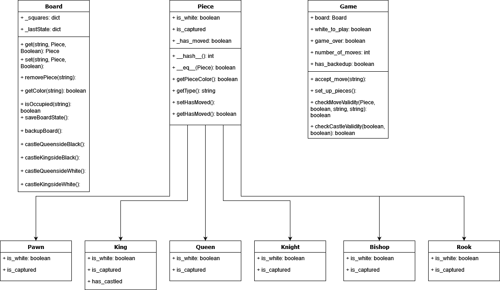
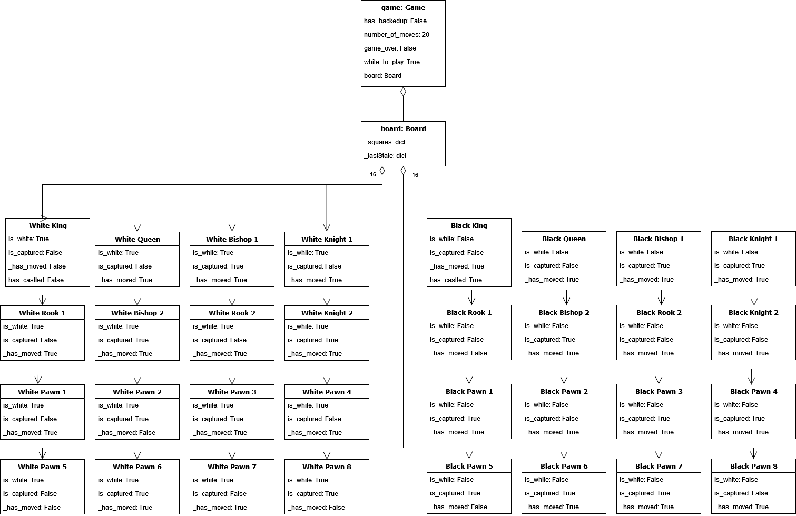
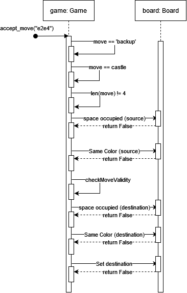
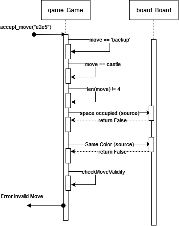

# Class Diagram

# Object Diagram

# Interface Diagram

# Interface Error Diagram

# Description
To start a chess game in the terminal enter: "python -m chess".\
The board will be displayed and white is to move.\
Once the player on the white side moves and the move is valid, it will be the player on the black side's turn to move.\
After each move, the terminal will update the board based on the previously entered move. If a move is invalid, that player will be asked to enter a different move.\
The game will end once there is a checkmate.

Each player has the ability to recall a move. After making a move, the player can enter "backup" to undo their previous move. This must be done prior to the opponent playing their next move. The backup functionality cannot be done consecutively. The player can only backup one move at a time. The undo only applies to that side's move.

# Moves
Moves shall be entered in sourcePositionDestinationPosition format.\
Examples:\
    &emsp;"e2e4" - moving a piece at e2 two squares ahead to e4\
    &emsp;"g7b7" - moving a piece along the same row from g7 to b7\
    &emsp;"c1h6" - moving a piece diagonally from c1 to h6\
    &emsp;"b1c3" - moving the knight on b1 to c3\
All movement rules of chess apply to this program.
A player will not be able to pass through any piece unless the moving piece is a knight. Since the knight moves in a 3x2 area, the only movement condition is that the destination location does not contain a piece of the same color as the knight.

# Tests
The test cases include all of the following which can be found in /tests:\
    &emsp;test_board\
    &emsp;test_castle\
    &emsp;test_checkmate\
    &emsp;test_errors\
    &emsp;test_move\
    &emsp;test_pieces\
    &emsp;test_undo\
    &emsp;test_view

test_board\
    &emsp;Tests when pieces are set that they exist in those places

test_castle\
    &emsp;Tests castling for both white and black as well as instances where castling is invalid (ex. king has already moved)

test_checkmate\
    &emsp;Tests the detection of a checkmate for both white and black kings

test_errors\
    &emsp;Tests types of movement errors that can occurr in the program\
        &emsp;&emsp;-Move Syntax\
        &emsp;&emsp;-Moving a non-existent piece\
        &emsp;&emsp;-Moving the oppenents pieces\
        &emsp;&emsp;-Moving the Bishop\
        &emsp;&emsp;-Moving the Rook\
        &emsp;&emsp;-Moving the Queen\
        &emsp;&emsp;-Moving the Knight\
        &emsp;&emsp;-Moving the Pawn\
        &emsp;&emsp;-Moving the King/checking itself\
        &emsp;&emsp;-Moving pieces over/through existing pieces\
        &emsp;&emsp;-Moving to occupied squares of the same color pieces\
        &emsp;&emsp;-A piece is pinned and cannot move due to the piece blocking line of sight of an enemy piece on the friendly king\
        &emsp;&emsp;-White Resigns\
        &emsp;&emsp;-Black Resigns

test_move\
    &emsp;Tests valid move correctly moves the piece
    
test_pieces\
    &emsp;Tests the differentiation of colors of each piece
    
test_setup\
    &emsp;Tests the board setup method accurately places the correct pieces in the correct location

test_undo\
    &emsp;Tests the playering being able to undo the previous move

test_view\
    &emsp;Tests the unicode display of each piece is correct
